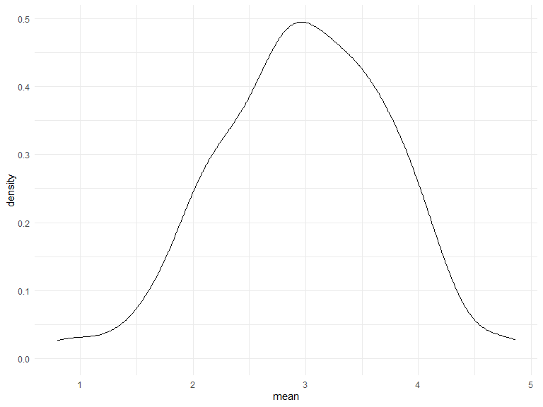

Simulation
================
Suning Zhao
2022-11-16

## Let’s simulate something.

I have a function.

``` r
sim_mean_sd = function(samp_size, mu = 3, sigma = 4){
  sim_data = 
  tibble(
    x = rnorm(n = samp_size, mean = mu, sd = sigma)
  )

sim_data %>% 
  summarize(
    mean = mean(x),
    sd = sd(x)
  )
}
```

I can “simulate” by running this line.

``` r
sim_mean_sd(30)
```

    ## # A tibble: 1 × 2
    ##    mean    sd
    ##   <dbl> <dbl>
    ## 1  3.01  4.42

## Let’s simulate a lot.

Let’s start with a for loop.

``` r
output = vector("list", length = 100)

for (i in 1:100){
  output[[i]] = sim_mean_sd(samp_size = 30)
}

bind_rows(output)
```

    ## # A tibble: 100 × 2
    ##     mean    sd
    ##    <dbl> <dbl>
    ##  1  3.24  3.75
    ##  2  3.77  3.80
    ##  3  3.90  3.80
    ##  4  3.57  4.67
    ##  5  3.13  3.27
    ##  6  3.57  3.65
    ##  7  3.31  4.27
    ##  8  3.65  3.92
    ##  9  1.89  3.62
    ## 10  3.22  3.79
    ## # … with 90 more rows
    ## # ℹ Use `print(n = ...)` to see more rows

Let’s use a loop function.

``` r
sim_results = 
  rerun(100, sim_mean_sd(samp_size = 30)) %>% 
      bind_rows()
```

Let’s look at results…

``` r
sim_results %>% 
  ggplot(aes(x = mean)) + geom_density()
```



``` r
sim_results %>% 
  summarize(
    avg_samp_mean = mean(mean),
    sd_samp_mean = sd(mean)
  )
```

    ## # A tibble: 1 × 2
    ##   avg_samp_mean sd_samp_mean
    ##           <dbl>        <dbl>
    ## 1          3.08        0.680

``` r
sim_results %>% 
  ggplot(aes(x = sd)) + geom_density()
```


